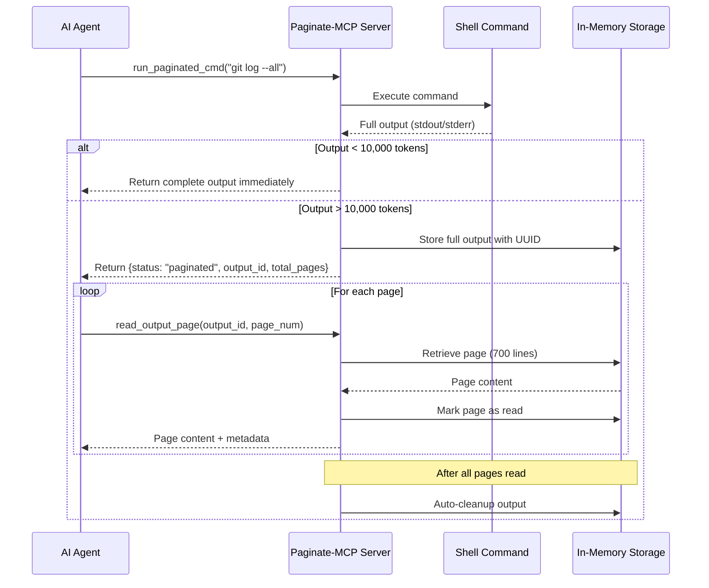

# Paginate-Cmd MCP Server

A Model Context Protocol (MCP) server that prevents output truncation when working with large command outputs. Perfect for ensuring AI agents can access and analyze complete command results without hitting context limits.

## Why Use This?

When running shell commands that produce large outputs (like `git diff`, `git log`, `cat large_file.txt`, or test results), Claude and other AI agents often truncate the output or fail to process the entire content. This leads to incomplete analysis and missed information.

Paginate-MCP solves this by:
- **Preventing truncation** - Automatically handles outputs exceeding 5,000 tokens
- **Preserving full context** - Ensures the agent can access all output through pagination
- **Seamless integration** - Works transparently with your existing workflows

## Setup

### Claude Code

Add this MCP server to Claude Code with a single command:

```bash
claude mcp add paginate_mcp npx paginate-mcp@latest
```

### Claude Desktop

Use directly with npx without any installation:

```bash
npx paginate-mcp
```

Or add to your Claude Desktop or configuration:

**MacOS**: `~/Library/Application Support/Claude/claude_desktop_config.json`
**Windows**: `%APPDATA%\Claude\claude_desktop_config.json`

```json
{
  "mcpServers": {
    "paginate-mcp": {
      "command": "npx",
      "args": ["-y", "paginate-mcp@latest"]
    }
  }
}
```

### Other MCP Clients

Use directly with npx without any installation:

```bash
npx paginate-mcp
```

## Example Usage

Once configured, you can ask Claude questions that would normally result in truncated output:

```
Read git diff against origin/main using paginate-mcp and present me some suggestions to improve it
```

Other useful examples:
- "Use paginate-mcp to run the full test suite and analyze all failures"
- "Read the entire application log from yesterday using paginate-mcp and identify error patterns"
- "Show me the complete git log for the last 100 commits using paginate-mcp"

## Tools

### run_paginated_cmd

Execute a shell command and capture its output.

**Parameters:**

- `command` (required): The shell command to execute
- `working_directory` (optional): Working directory for command execution
- `timeout` (optional): Timeout in seconds (default: 30)

**Returns:**

- If output < 5,000 tokens: Complete output immediately
- If output > 5,000 tokens: Paginated response with `output_id` for retrieval

**Example (small output):**

```json
{
  "status": "complete",
  "output": "=== STDOUT ===\nHello World\n\n=== STDERR ===\n\n=== Return Code: 0 ===",
  "estimated_tokens": 25,
  "command": "echo 'Hello World'",
  "return_code": 0
}
```

**Example (large output):**

```json
{
  "status": "paginated",
  "output_id": "uuid-here",
  "message": "Output too large (25000 estimated tokens). Use 'read_output_page' tool to retrieve all 5 pages sequentially.",
  "instruction": "IMPORTANT: You must paginate through ALL 5 pages...",
  "command": "cat large_file.txt",
  "return_code": 0,
  "total_pages": 5,
  "total_lines": 3421,
  "estimated_tokens": 25000
}
```

### read_output_page

Retrieve a specific page of stored command output.

**Parameters:**

- `output_id` (required): The ID from the paginated response
- `page` (required): Page number to retrieve (1-indexed)

**Returns:**

```json
{
  "output_id": "uuid-here",
  "command": "cat large_file.txt",
  "page": 2,
  "total_pages": 5,
  "pages_read": [1, 2],
  "all_pages_read": false,
  "content": "page content here...",
  "has_next": true,
  "has_previous": true
}
```

## Token Estimation

The server estimates tokens as `text.length * 0.25`. This is a conservative estimate to ensure outputs fit within Claude's context window.

## Pagination Behavior

- **Page Size**: 700 lines per page
- **Character Limit**: 30,000 characters per page (hard limit)
- **Automatic Cleanup**: Output storage is automatically cleaned up when all pages have been read

## Dependencies

### Production

- `@modelcontextprotocol/sdk` - MCP protocol implementation

### Development

- `typescript` - TypeScript compiler
- `@types/node` - Node.js type definitions

### Built-in Modules (No Installation Required)

- `child_process` - Command execution
- `crypto` - UUID generation
- `util` - Promise utilities

## How It Works



The server maintains two in-memory data structures:

- `outputStorage`: Stores full command outputs for pagination
- `pagesRead`: Tracks which pages have been retrieved

Storage is automatically cleaned up when all pages of an output have been read.

## Features

- Execute shell commands with full stdout/stderr capture
- Automatic pagination for outputs exceeding 10,000 tokens
- Page-based retrieval for large outputs (700 lines or 30KB per page)
- No external dependencies beyond the MCP SDK
- TypeScript implementation with full type safety

## License

MIT
